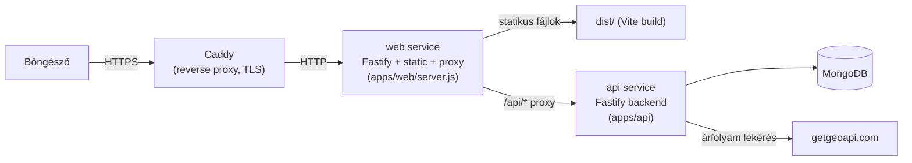
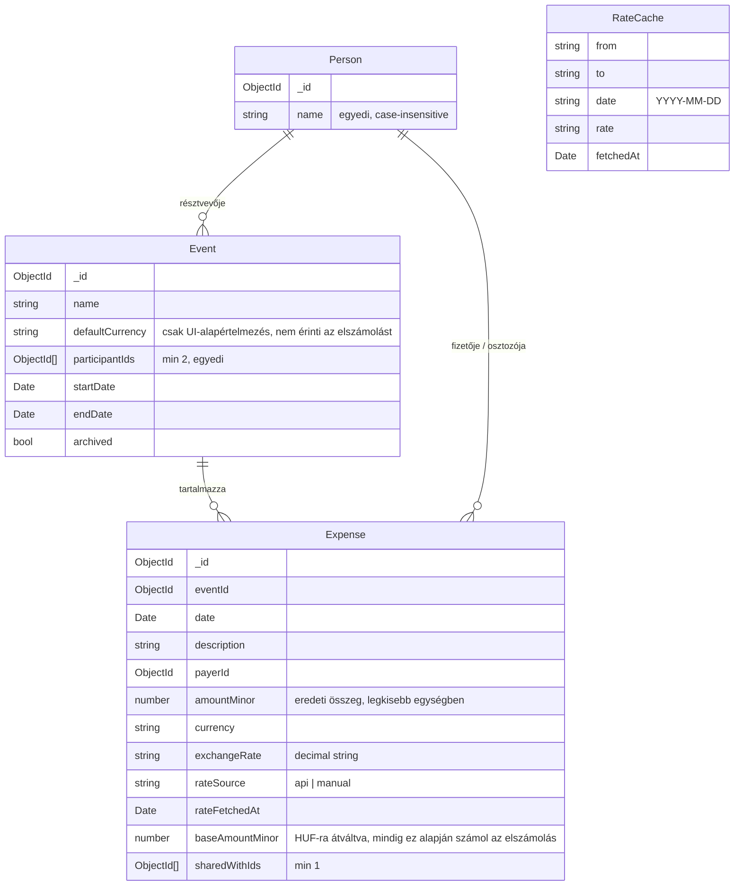
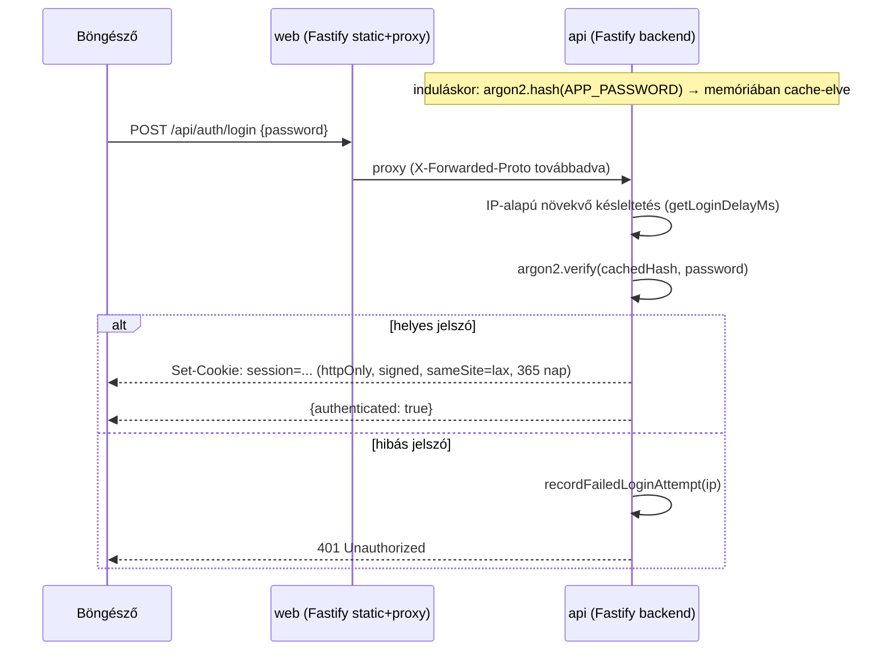
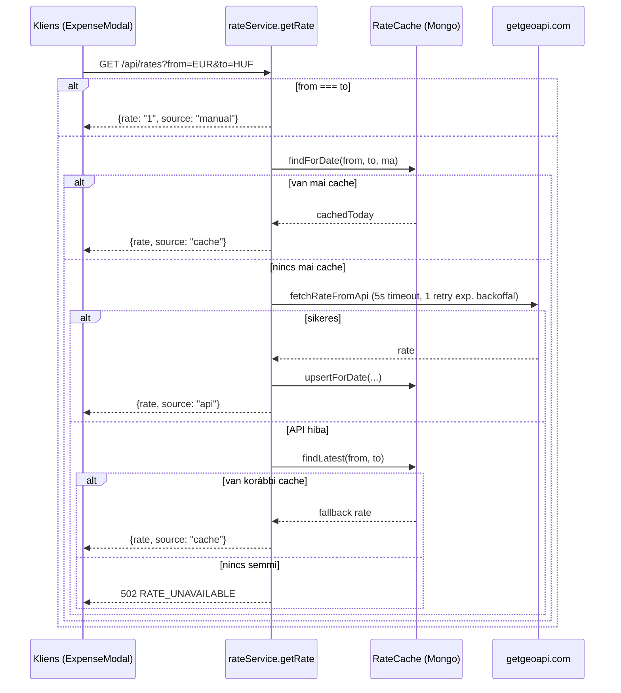

# Fillér — architektúra és működés

Ez a dokumentum a kódbázis alapján mutatja be, **mi** a Fillér, és **hogyan**
működik belülről: architektúra, adatmodell, hitelesítés, pénzkezelés,
elszámolási algoritmus, backend/frontend felépítés és a deploy folyamat.
A felhasználói szintű leírásért lásd a gyökér [`README.md`](../README.md)-t —
ez a dokumentum annak technikai mélyfúrása.

## Tartalom

1. [Mi ez az alkalmazás](#1-mi-ez-az-alkalmazás)
2. [Monorepo felépítés és technológiák](#2-monorepo-felépítés-és-technológiák)
3. [Magas szintű architektúra](#3-magas-szintű-architektúra)
4. [Adatmodell](#4-adatmodell)
5. [Hitelesítés és munkamenet](#5-hitelesítés-és-munkamenet)
6. [Pénzkezelés](#6-pénzkezelés)
7. [Árfolyam-lekérés és cache](#7-árfolyam-lekérés-és-cache)
8. [Elszámolási algoritmus](#8-elszámolási-algoritmus)
9. [Backend rétegzés és API végpontok](#9-backend-rétegzés-és-api-végpontok)
10. [Kliensoldali offline réteg](#10-kliensoldali-offline-réteg)
11. [Hibakezelés](#11-hibakezelés)
12. [Frontend felépítés](#12-frontend-felépítés)
13. [Deployment](#13-deployment)
14. [Kódminőség](#14-kódminőség)

---

## 1. Mi ez az alkalmazás

A Fillér egy **self-hosted, egyetlen megosztott jelszóval védett** webapp
közös utazások/alkalmak költségeinek elszámolására. A résztvevőket egy
globális névjegyzékből válogatod össze eseményenként, a kiadásokat tetszőleges
pénznemben rögzíted, az app pedig kiszámolja, ki kinek mennyivel tartozik,
minimalizált utalás-listával.

Nincs regisztráció, nincsenek felhasználói fiókok — csak egy jelszó és egy
session cookie. Ez tudatos egyszerűsítés: kis, zárt csoportnak (barátok,
utazótársak) szánt eszköz, nem multi-tenant SaaS.

## 2. Monorepo felépítés és technológiák

```
apps/api           Fastify backend (Node.js)
apps/web            Vue 3 SPA + saját kis Fastify kiszolgáló szerver (server.js)
packages/shared     Közös Zod sémák, pénz- és elszámolási logika
```

| Réteg                  | Technológia                                                         |
| ---------------------- | ------------------------------------------------------------------- |
| Backend keretrendszer  | Fastify 5, `fastify-type-provider-zod`                              |
| Adatbázis              | MongoDB 7 (mongoose ODM)                                            |
| Validáció              | Zod mindenhol — HTTP be-/kimenet, külső API válasz, domain logika   |
| Pénz aritmetika        | `decimal.js` (kerekítés), egész `amountMinor` a legkisebb egységben |
| Jelszó hash            | `argon2` (argon2id)                                                 |
| Frontend keretrendszer | Vue 3 (`<script setup>`), Vue Router 4, Pinia                       |
| Build                  | Vite (frontend), natív Node (`node --watch` backend fejlesztéskor)  |
| Konténerizáció         | Docker multi-stage build-ek, Docker Compose                         |
| Reverse proxy (prod)   | Caddy (compose service label-eken keresztül, a repón kívül fut)     |

Nincs TypeScript. A fordítási idejű típusellenőrzést a **Zod validáció minden
határátlépésnél** helyettesíti (HTTP be- és kimenet, külső API válasz), a
domain típusokat pedig JSDoc dokumentálja. A `packages/shared` csomagot mind
a frontend, mind a backend importálja (`@filler/shared` workspace-csomagként)
— ez garantálja, hogy a pénz- és elszámolás-logika **egyetlen helyen** létezik,
nem duplikálva kliens és szerver oldalon.

## 3. Magas szintű architektúra

Produkciós módban **nincs nginx**: a `web` service saját, kicsi Fastify
szervere (`apps/web/server.js`) szolgálja ki a Vite build statikus kimenetét,
és proxyzza a `/api` alatti kéréseket a backendre. Elé egy külső Caddy
reverse proxy áll (a `compose.yaml` `web` service labeljein keresztül), ami
a TLS-t és a domain-routingot adja.



Fejlesztői módban (`compose.dev.yaml`) ehelyett a Vite dev szerver fut
`5173`-as porton hot reloaddal, és maga proxyzza a `/api`-t a backend felé;
a backend `node --watch`-csal indul, mindkettő bind mountolt forráskönyvtárral.

## 4. Adatmodell

Négy Mongo kollekció, mindegyik `strict: 'throw'` módban (séman kívüli mező
írása hibát dob, nem hallgatva eldobja).



Fontos üzleti szabályok, amiket a modell/service réteg kényszerít ki:

- **Person törlés blokkolva**, ha a személy bármely esemény résztvevője, vagy
  bármely kiadás fizetője/osztozója (`personService.deletePerson` ellenőrzi
  mindkettőt, a hibaválaszban felsorolva az érintett eseményeket/kiadásokat).
- **Event résztvevő eltávolítása blokkolva**, ha az eltávolítandó személy
  szerepel valamelyik kiadásban fizetőként vagy osztozóként
  (`eventService.assertRemovedParticipantsNotInUse`).
- **Event törlésekor** az összes hozzá tartozó kiadás is törlődik
  (`eventService.deleteEvent` → `expenseRepository.deleteAllForEvent`).
- `defaultCurrency` az `Event`-en **kizárólag** azt jelöli ki, milyen
  pénznemmel nyíljon meg egy új kiadás űrlapja — az elszámolás mindig
  `SETTLEMENT_CURRENCY` (HUF) alapján történik, ettől függetlenül (lásd
  [6. fejezet](#6-pénzkezelés)).

## 5. Hitelesítés és munkamenet

Nincs felhasználónév/regisztráció: egyetlen, `.env`-ben (`APP_PASSWORD`)
tárolt, ember-olvashatóan megadott jelszó védi az egész appot.



Kulcs mechanizmusok:

- **Jelszó sosem tárolódik plaintextként** induláson túl: `initPasswordHash`
  argon2id hash-eli egyszer, `verifyPassword` ez ellen ellenőriz
  (`apps/api/src/services/authService.js`).
- **Session cookie**: aláírt (`signed: true`, `@fastify/cookie` `secret`),
  `httpOnly`, `sameSite: 'lax'`, 365 napos élettartam. A cookie értéke maga
  egy konstans string (`"authenticated"`) — az aláírás integritása garantálja,
  hogy nem hamisítható, nem session-id-t azonosít adatbázisban.
- **`secure` flag a tényleges kapcsolat alapján dől el**, nem `NODE_ENV`
  alapján: `request.protocol === 'https'`. Ez azért kritikus, mert egy
  `Secure` cookie-t a böngésző eldob plain HTTP felett — LAN IP-n vagy
  Tailscale-en, TLS nélkül elérve ez a `false` ág, Caddy mögött TLS-en
  keresztül a `true` ág. A `web` szerver `rewriteRequestHeaders`-je adja
  tovább a Caddytól kapott valódi protokollt `X-Forwarded-Proto`-ként a
  backendnek (`apps/web/server.js`), a backend `trustProxy: true`-val
  bízik ebben.
- **Brute force védelem két rétegben**:
  1. `@fastify/rate-limit`: kemény limit, 5 kérés/perc IP-nként a
     `/login` route-on (`config.rateLimit`).
  2. `loginAttemptTracker.js`: IP-nkénti, csúszóablakos hibaszámláló, ami
     minden sikertelen kísérlet után 300 ms-mal növekvő, 3000 ms-ban
     plafonozott mesterséges késleltetést vezet be a válasz elküldése előtt
     — ez lassítja a brute force-t a hard rate limit ablakán belül is.
- **`requireAuth` middleware**: minden `/api` alatti route egy `onRequest`
  hookkal védett al-plugin alá van regisztrálva (`app.js`), kivéve
  `/api/auth/*` és `/health`. A hook egyszerű cookie-ellenőrzés, DB-hívás
  nélkül.
- **Frontend router guard** (`apps/web/src/router/index.js`): minden
  navigáció előtt lefut, ha még nincs ellenőrizve az állapot, meghívja a
  `GET /api/auth/me`-t; ha a cél route hitelesítést igényel és a felhasználó
  nincs bejelentkezve, a `login` route-ra irányít, a visszatérési útvonalat
  query paraméterben megőrizve. Az API kliens (`apps/web/src/api/client.js`)
  emellett bármely `401`-es válaszra (kivéve maga a `/auth/me`) is a login
  oldalra navigál — ez fogja el az időközben lejárt/törölt session-t.

## 6. Pénzkezelés

A pénzkezelés szigorú szabályokra épül, amiket a `packages/shared` csomag
kényszerít ki és amiket **ESLint szabály is véd** (lásd
[14. fejezet](#14-kódminőség)):

- **Minden összeg egész szám, a pénznem legkisebb egységében**
  (`amountMinor`) tárolódik — sosem lebegőpontos major egységben. A
  legkisebb egység kitevőjét (`CURRENCY_MINOR_EXPONENTS`,
  `packages/shared/src/currency/exponents.js`) pénznemenként definiálja a
  rendszer: HUF/JPY = 0 tizedes (a legkisebb egység maga a forint/jen),
  EUR/USD/CHF/GBP/PLN/CZK/RON = 2 tizedes (cent).
- **`parseFloat`, `Number.parseFloat` és `.toFixed(` tiltva** az egész
  kódbázisban egy `no-restricted-syntax` ESLint szabállyal, egyetlen
  kivétellel: `packages/shared/src/currency/format.js`, ami az **egyetlen
  hely**, ahol egy összeg major egységre alakítása megengedett — kizárólag
  megjelenítésre, sosem tárolásra vagy számításra.
- **Árfolyam-átváltás** (`convertMinorAmount`,
  `packages/shared/src/currency/convert.js`) `decimal.js`-szel, fél felfelé
  kerekítéssel:
  ```
  targetAmountMinor = round(amountMinor × rate × 10^(targetExponent − sourceExponent))
  ```
  Az árfolyam maga sosem `number`, hanem egy validált decimális **string**
  (`exchangeRateStringSchema`, regex: `^\d+(\.\d+)?$`) — így elkerülhető,
  hogy egy lebegőpontos kerekítési hiba becsússzon az árfolyamba magába.
- **Elszámolási pénznem mindig HUF** (`SETTLEMENT_CURRENCY`), **eseményenkénti
  választás nélkül**. Ez egy valós, korábban előfordult bugra adott
  tudatos válasz: ha egy esemény alapvalutáját a felvett kiadások után
  változtatták volna meg, a régi kiadások alapösszege rossz pénznemben
  jelent volna meg. Ezért az `Event.defaultCurrency` mező **csak UI-célra**
  létezik (előre kijelöli, milyen pénznemmel nyíljon meg az új kiadás
  űrlapja), a settlementhez nincs köze. Az `apps/api/src/scripts/migrate-settlement-currency-to-huf.js`
  egyszeri migrációs script dokumentálja is ezt a történetet: amikor ez a
  döntés megszületett, minden meglévő kiadás `baseAmountMinor`-ját
  újraszámolta a saját `(amountMinor, currency, exchangeRate)` hármasa
  alapján, HUF-ra célozva.
- **`expenseService.buildExpenseData`**: ha a kiadás pénzneme már
  `SETTLEMENT_CURRENCY`, nincs átváltás és nincs API-hívás — az árfolyam
  kényszerítetten `"1"`, a `rateSource` `"manual"`, a `baseAmountMinor`
  megegyezik az `amountMinor`-ral. Egyébként a bejövő `exchangeRate` és
  `rateSource` mezőt (amit a kliens az árfolyam-API-ból vagy kézi
  bevitelből kapott) veszi át, és kiszámolja a `baseAmountMinor`-t.
- **Felső korlát**: egy kiadás összege legfeljebb `999999` lehet a pénznem
  nagyobb egységében (`MAX_EXPENSE_MAJOR_AMOUNT`), amit a Zod séma
  (`createExpenseBodySchema` `superRefine`-ja) és a frontend input egyaránt
  kikényszerít — ez zárja ki a véletlenül beírt extra számjegyeket.
- **`formatMoney`** (`packages/shared/src/currency/format.js`) `Intl.NumberFormat`-tal
  formáz megjelenítésre, a pénznem kitevőjét használva tizedesjegy-számként.

## 7. Árfolyam-lekérés és cache

Az árfolyamot a [getgeoapi.com](https://www.getgeoapi.com/) külső API-ból
kérdezi le a rendszer, napi Mongo cache-eléssel és hibatűrő fallbackkel.



Részletek:

- `RateCache` egy `(from, to, date)` hármasra `unique` indexelt kollekció —
  **naponta legfeljebb egyszer** hívja ki az élő API-t egy adott
  valutapárra, utána ugyanazon a napon a cache-elt érték jön vissza.
- A cache dokumentumokra egy 24 órás TTL index is fut
  (`expireAfterSeconds: RATE_CACHE_TTL_SECONDS` a `createdAt` mezőn), de a
  gyakorlatban a napi kulcs miatt ez ritkán aktiválódik ténylegesen —
  inkább biztonsági háló a felhalmozódás ellen.
- `currencyApiClient.fetchRateFromApi`: 5 másodperces `AbortController`
  timeout, 1 újrapróbálkozás exponenciális backoffal (500 ms), a válasz
  Zod-validált (`geoApiConvertResponseSchema`).
- Ha az élő hívás hibázik **és** nincs semmilyen korábbi cache-elt érték,
  a hívás `502 RATE_UNAVAILABLE` hibával bukik — a frontend ekkor kézi
  árfolyam-bevitelre vált (`ExpenseModal.vue` `rateError` ág).
- A kliensoldali `ExpenseModal.vue` az árfolyamot csak **előnézetre** (a
  HUF-ban várható alapösszeg megjelenítésére) és a kiadás rögzítésekor
  elmentendő `exchangeRate`/`rateSource` mezőkhöz használja — a tényleges
  `baseAmountMinor`-t mindig a **backend** számolja újra
  (`buildExpenseData`), nem bízik a kliens által küldött értékben.

## 8. Elszámolási algoritmus

A `packages/shared/src/settlement/computeSettlement.js` a rendszer szíve:
egy esemény résztvevőinek egyenlegét és a szükséges, minimalizált
utalás-listát számolja ki, kizárólag a kiadások `baseAmountMinor` (HUF)
mezője alapján.

### 8.1 Egyenlegszámítás

Minden résztvevőre:

```
paidMinor   = az összes kiadás baseAmountMinor összege, ahol ő a payerId
owedMinor   = az összes kiadásból rá eső rész összege (lásd lent: splitEqually)
balanceMinor = paidMinor − owedMinor
```

A `balanceMinor` összege pontosan `0` minden esemény esetén (ez egy
invariáns, amit a séma és a logika együtt garantál). Pozitív egyenleg =
"jár neki", negatív = "fizetnie kell".

### 8.2 Egyenlő osztás kerekítési maradékkal

`splitEqually` (`packages/shared/src/currency/split.js`) egy összeget
egyenlő részekre oszt egész `amountMinor` egységekben. Mivel az összeg nem
mindig osztható maradék nélkül a résztvevők számával, a maradékot
**determinisztikusan** osztja szét: a résztvevő-azonosítókat (string)
ábécé sorrendbe rendezi, és elölről egyesével kapják meg a plusz egységet.

```
amountMinor = 1000, participantIds = ["b", "a", "c"]
count = 3, baseShare = floor(1000/3) = 333, remainder = 1
rendezett id-k: ["a", "b", "c"] → "a" kapja a +1-et
eredmény: { a: 334, b: 333, c: 333 }   (összeg pontosan 1000)
```

Ez a determinizmus fontos: ugyanaz a bemenet mindig ugyanazt az eredményt
adja, függetlenül attól, milyen sorrendben tárolja a DB a résztvevőket.

### 8.3 Transzferek: mohó algoritmus

`computeTransfers` minden lépésben a **legnagyobb adóst** párosítja a
**legnagyobb hitelezővel**:

1. Adósok (`balanceMinor < 0`) és hitelezők (`balanceMinor > 0`) külön
   listába kerülnek, a saját fennmaradó összegükkel.
2. Ismétlődő ciklusban: mindkét lista csökkenő összeg szerint rendeződik
   (holtverseny esetén `personId` szerint, a determinizmus kedvéért), a
   legnagyobb adós és legnagyobb hitelező között a `min(adós, hitelező)`
   összegű utalás jön létre.
3. Amelyik fél (adós vagy hitelező) elérte a `0`-t, kikerül a listából.
4. A ciklus addig fut, amíg mindkét lista ki nem ürül.

Ez a mohó stratégia nem feltétlenül globálisan minimális tranzakciószámú
minden elméleti esetben, de a gyakorlatban (kevés résztvevős, néhány
kiadásos esemény) jó, kiszámítható eredményt ad, és **O(n log n)**
időbonyolultságú, ahol n a résztvevők száma.

### 8.4 Példa

3 résztvevő (Anna, Béla, Cili), egyetlen 3000 Ft-os kiadás, amit Anna
fizetett, és amin mindhárman osztoznak:

```
paidMinor:  Anna 3000, Béla 0, Cili 0
owedMinor:  Anna 1000, Béla 1000, Cili 1000   (splitEqually, nincs maradék)
balance:    Anna +2000, Béla -1000, Cili -1000

transfer 1: Béla → Anna 1000  (Béla balance 0, kikerül)
transfer 2: Cili → Anna 1000  (Cili balance 0, kikerül)
```

Nulla egyenlegű résztvevő (aki pontosan annyit fizetett, amennyi rá esett)
sosem szerepel egyik listában sem, tehát sosem jelenik meg transzferben.

## 9. Backend rétegzés és API végpontok

Szigorú rétegzés: **routes → services → repositories**. A Mongoose modell
sosem szivárog ki a route rétegbe — a repository réteg mindig egyszerű,
sorosított (`serialize`) sima objektumot ad vissza (`id` string, nem
`ObjectId`), amit a Zod response séma validál.

```
routes/*.js        HTTP réteg: Zod séma-kötés (body/params/querystring/response),
                    válasz-kódok, semmi üzleti logika
services/*.js       Üzleti szabályok, validáció, keresztreferenciák
                    (pl. "a résztvevő nem távolítható el, ha kiadásban szerepel")
repositories/*.js   Mongoose lekérdezések + soros nyers objektummá alakítás
models/*.js         Mongoose séma definíciók, DB-szintű validáció/indexek
```

Minden route-hoz Zod séma kötődik `fastify-type-provider-zod`-on keresztül —
ez validálja a bemenetet **és** a kimenetet is (response schema), tehát ha a
service réteg véletlenül rossz alakú objektumot adna vissza, a szerializáció
maga is hibát dobna fejlesztéskor.

### API végpontok

| Módszer  | Útvonal                      | Védett? | Leírás                                          |
| -------- | ---------------------------- | ------- | ----------------------------------------------- |
| `POST`   | `/api/auth/login`            | –       | Bejelentkezés jelszóval, rate-limitelt          |
| `POST`   | `/api/auth/logout`           | –       | Session cookie törlése                          |
| `GET`    | `/api/auth/me`               | –       | Aktuális hitelesítési állapot                   |
| `GET`    | `/api/people`                | ✓       | Névjegyzék listázása                            |
| `POST`   | `/api/people`                | ✓       | Új személy (egyedi név, case-insensitive)       |
| `PATCH`  | `/api/people/:id`            | ✓       | Átnevezés                                       |
| `DELETE` | `/api/people/:id`            | ✓       | Törlés (blokkolva, ha használatban)             |
| `GET`    | `/api/events`                | ✓       | Események listázása, összköltséggel             |
| `POST`   | `/api/events`                | ✓       | Új esemény (min. 2 résztvevő)                   |
| `GET`    | `/api/events/:id`            | ✓       | Egy esemény                                     |
| `PATCH`  | `/api/events/:id`            | ✓       | Szerkesztés (résztvevő-eltávolítás ellenőrizve) |
| `DELETE` | `/api/events/:id`            | ✓       | Törlés a kiadásaival együtt                     |
| `GET`    | `/api/events/:id/expenses`   | ✓       | Esemény kiadásai                                |
| `POST`   | `/api/events/:id/expenses`   | ✓       | Új kiadás                                       |
| `PATCH`  | `/api/expenses/:id`          | ✓       | Kiadás szerkesztése                             |
| `DELETE` | `/api/expenses/:id`          | ✓       | Kiadás törlése                                  |
| `GET`    | `/api/events/:id/stream`     | ✓       | Élő kiadás-frissítés (SSE), lásd 9.1            |
| `GET`    | `/api/events/:id/settlement` | ✓       | Egyenlegek + minimalizált utalás-lista¹         |
| `GET`    | `/api/rates?from=&to=`       | ✓       | Árfolyam lekérése (cache-elt vagy élő)          |
| `GET`    | `/health`                    | –       | Health check (Docker healthcheck-hez)           |

¹ A frontend ma nem hívja: a `SettlementPanel` a betöltött kiadáslistából,
helyben számol a `computeSettlement`-tel (`packages/shared`) — ugyanazzal a
függvénnyel, amit ez a végpont is használ. A végpont API-teljesség
végett maradt meg, nem hívatlanul elfelejtve.

### 9.1 Élő kiadás-frissítés (SSE)

Ha többen néznek egy eseményt (közös utazáson tipikusan mindenki a saját
telefonján), a más eszközön felvitt kiadás oldalfrissítés nélkül megjelenik.
A csatorna **egyirányú** (szerver → kliens), ezért Server-Sent Events, nem
WebSocket, sima HTTP-n megy.

```
POST/PATCH/DELETE ─► expenseService ──► expenseRepository (Mongo)
                          │
                          │ publishExpenseChange(eventId, message)
                          ▼
                  eventBus (EventEmitter, csatorna: "event:<eventId>")
                          │
GET /api/events/:id/stream ◄┘
                          │
      EventDetailView ─► openEventStream ─► expensesStore ─► ExpenseTable
```

A pub/sub (`apps/api/src/services/eventBus.js`) szándékosan **memóriában** van,
külső broker nélkül: egyetlen `api` konténer fut, így nincs mit
szinkronizálni példányok között. Ha ez megváltozik, ennek a modulnak a
belsejét kell kicserélni, a felületét nem.

Üzenettípusok — mindhárom a `expenseStreamMessageSchema` (shared) szerint
validálva **kimenetkor és bejövetkor is**, ahogy a rendes HTTP határátlépések:
`expense.created`, `expense.updated` (a teljes kiadással), `expense.deleted`
(csak az azonosítóval).

Két dolog kell ahhoz, hogy a stream a `web` szerver proxyján át is éljen:
20 mp-enkénti heartbeat komment, és a proxy `undici: { bodyTimeout: 0,
headersTimeout: 0 }` beállítása (`apps/web/server.js`) — különben az undici
alapértelmezett időkorlátja elvágja a hosszan élő választ.

**Platformfüggetlen transzport** (`apps/web/src/api/eventStream.js`,
`openEventStream`): a kliens oldal két megvalósítást takar egy közös felület
mögé.

- **Böngésző**: `EventSource`, same-origin kérés. A hitelesítést a httpOnly
  session cookie adja, az újrakapcsolódás a böngészőé (a szerver `retry:
5000` mezője szerint).
- **Natív Android app**: az `EventSource` nem tud `Authorization` fejlécet
  küldeni, a `CapacitorHttp` által patchelt globális `fetch` pedig nem
  streamel — ezért az eredeti, Capacitor által eltárolt `window.
CapacitorWebFetch`-fel olvassuk a streamet, Bearer tokennel, és az
  újrakapcsolódás a kliens dolga: növekvő várakozással (1 mp-től 30 mp-ig
  duplázódva), amit egy `ATTEMPT_RESET_MS` (3 mp) él kapcsolat nulláz —
  különben egy kérést elfogadó, majd rögtön EOF-oló szerver a számlálót
  minden körben nullázná. Egy **heartbeat-figyelő** (45 mp, a szerver 20
  mp-es pingjének több mint duplája) megszakítja a kapcsolatot, ha se
  üzenet, se ping nem érkezik — ez fogja el a félig nyitva ragadt socketet,
  amit a hálózat szintjén sosem venne észre a `reader.read()`. A 401/403
  (lejárt token) és a 404 (törölt esemény) válasz **terminális**: nincs
  értelme ugyanazzal a hitelesítő adattal vagy egy soha meg nem nyíló
  streamre örökké próbálkozni.
  A natív build API-alapcíme fordítási időben rögzített, abszolút URL
  (lásd az Android APK fejezetet a README-ben) — emiatt a natív stream-kérés
  **cross-origin**, tehát a böngészőmotor CORS-preflighttal kezeli, szemben a
  böngészős `EventSource` same-origin kérésével.

**CORS a hijackolt válaszon:** a stream route `reply.hijack()`-kel kerüli meg
a normál `send()`/`onSend` folyamatot, tehát a `@fastify/cors` plugin által
`reply.header(...)`-rel csak eltárolt fejlécek (`app.js`,
`NATIVE_APP_ORIGINS` egy szűk, fix lista) sosem jutnának ki a socketre — a
natív kérés válasz nélkül elutasítva végződne. A stream route
(`apps/api/src/routes/events.js`) ezért kézzel írja ki ugyanazt, amit a
plugin tenne: `apps/api/src/config/cors.js` egyetlen `corsHeadersFor(origin)`
függvénye dönti el, mely origin engedélyezett, hogy ez a döntés ne
csúszhasson szét a plugin-regisztrációtól. Nincs `Access-Control-Allow-
Credentials`: a natív kérés nem cookie-val hitelesít, hanem fejléces
tokennel, és `credentials` opció nélkül megy, tehát a böngésző sosem nézi meg
ezt a fejlécet rajta.

**Törzs nélküli DELETE a natív appból:** a Capacitor a nem-GET kéréseket az
Android natív HTTP-rétegén (`HttpURLConnection`) küldi — a `Dalvik/...`
user-agent ezt el is árulja a szerver naplójában. Ez a réteg a **törzs nélküli**
kérésekre is ráteszi a saját alapértelmezett
`application/x-www-form-urlencoded` Content-Type-ját, és ez a JS-réteg alatt
történik, tehát a kliens nem tudja megakadályozni. A Fastify enélkül minden
appból érkező `DELETE`-et 415-tel („Unsupported Media Type") utasít el, és a
törlés némán nem működik a telefonon. Ezért az `app.js` regisztrál egy
content-type parsert erre a típusra, ami **kizárólag az üres törzset** fogadja
el (`body = undefined`); egy valódi urlencoded törzs továbbra is 415-öt kap,
mert az API csak JSON-t vesz. Ne töröld ezt a parsert: nem redundancia, hanem
az egyetlen pont, ahol ez a platform-kvirk kezelhető.

**Elmaradt üzenetek:** nincs szerveroldali `Last-Event-ID` puffer. Helyette a
store újrakapcsolódáskor és a fül előtérbe kerülésekor csendben (a
„Betöltés…" jelző felvillantása nélkül) újratölti a teljes listát. Ez minden
szakadás után garantáltan konzisztens állapotot ad, jóval kevesebb kóddal.
Ugyanezért az `EventDetailView` az esemény dokumentumát (a résztvevőlistát)
is csendben újratölti újrakapcsolódáskor és előtérbe kerüléskor — ez az
elszámolás-számítás bemenete, és enélkül elavulhatna.

A kliens oldali beszúrás idempotens: a saját mutáció után ugyanaz a kiadás az
SSE-n is visszajön, ezért az `upsertExpense` azonos `id`-re cserél, nem
duplikál — és az egyező `updatedAt` alapján tudja, hogy ezt a változást már
mi magunk alkalmaztuk, tehát nem villantja fel újra a sort.

## 10. Kliensoldali offline réteg

Egy IndexedDB-alapú réteg (`apps/web/src/offline/`, az `idb` csomaggal) ül a
Pinia store-ok és az `apiClient` között — a böngészőben és az APK-ban
egyaránt aktív, nem natív-specifikus. Két object store egy közös adatbázisban
(`db.js`):

- **`cache`**: a szervertől kapott olvasások legutóbbi állapota, kulcsonként
  (`fetchWithCache` írja). Kulcsok: `events`, `people`, `expenses:<eseményId>`,
  `event:<eseményId>` és `rate:<deviza>:<deviza>`.
- **`outbox`**: a még fel nem töltött kiadás-módosítások, `pending`/`failed`
  státusszal.

### 10.1 Olvasás: hálózat-először, cache tartalékként

`fetchWithCache` (`offline/cache.js`) mindig a hálózatot próbálja először; a
sikeres választ egyúttal a cache-be is írja. Csak a hálózat **tényleges,
besorolatlan** elérhetetlensége (dobott, nem `ApiError`/`ZodError` kivétel)
esik vissza a legutóbb cache-elt válaszra, `stale: true` jelzéssel — ezt az
`OfflineBanner.vue` egy halk sávval mutatja („Offline — utoljára frissítve:
…”).

Két hibatípus **szándékosan sosem** esik vissza cache-re, még akkor sem, ha
lenne mit visszaadni:

- **`ApiError`** — a szerver ténylegesen válaszolt (pl. 404, 401,
  validációs hiba). Ez nem hálózathiba, hanem egy valódi, a hívóra tartozó
  válasz; egy csendes cache-re-esés elrejtené a felhasználó elől, hogy pl. a
  session lejárt.
- **`ZodError`** — a válasz 2xx volt, de a törzse nem illik a várt sémára.
  Ez azt jelenti, hogy a kliens és a szerver kontraktusa szétcsúszott
  (pl. app-frissítés után); ezt hangosan kell jelezni, egy néma
  cache-re-esés örökre elrejthetné ezt a hibát.

**Ezt a megkülönböztetést ne told el egyetlen közös `catch`-csel** — a
két hibatípus fejlesztői hibát jelez, a hálózathiba pedig a normál,
elvárt offline esetet.

**Az eseményoldal kritikus útján minden olvasás ezen megy át**, az egyetlen
eseményt betöltő `fetchEvent` is (`event:<eseményId>` kulcson) — nem csak a
listák. Ez nem szépészeti kérdés: az `EventDetailView` a teljes törzsét (a
kiadástáblát, az elszámolást és a „+ Új kiadás" gombot) elrejti, ha az
esemény betöltése hibázik, tehát egyetlen cache nélküli olvasás ezen az
úton offline az egész oldalt — az offline ÍRÁS belépőjét is — egy
hibaüzenetre cserélné, hiába jött meg a kiadáslista a cache-ből. **Ne
vezessünk be új, cache nélküli olvasást erre az útra.**

A **csendes háttérfrissítések** ezzel szemben szándékosan cache-tartalék
nélküliek (`events.js` `refreshQuietly`/`refreshEvent`, `expenses.js`
`refreshQuietly`): ott már látszik adat a képernyőn, és egy cache-re-esés
csak lecserélhetné a láthatót egy régebbi másolatra. Ezek a hibát elnyelik
és a láthatót hagyják.

**A sikeres csendes frissítés viszont ugyanúgy írja a cache-t és jelöli
frissnek a kulcsot**, mint a `fetchWithCache` — ezt a `refreshIntoCache`
(`offline/cache.js`) végzi, és minden csendes frissítésnek ezen kell
mennie, nem közvetlenül az `apiClient`-en. Ok: a `setFresh` egyedül a
`fetchWithCache`-ből futott, viszont **minden helyreállási út** (stream
újrakapcsolódás, előtérbe kerülés, lehúzásos frissítés) csendes frissítést
hív. Egy egyszer elavultra jelölt kulcs így a munkamenet végéig elavult
maradt: a felhasználó látta frissülni a listát, miközben a sáv továbbra is
azt állította, hogy régi adatot néz. **A „nincs cache-tartalék” tehát nem
azt jelenti, hogy a cache-t ne is frissítenénk** — a kettő két külön
kérdés (mit MUTATUNK bukáskor, illetve mit ÍRUNK sikerkor).

**Ismert, tudatosan vállalt maradék: az élő stream nem írja a cache-t.** Az
SSE-n érkező kiadásokat (`applyStreamMessage`) a store azonnal megjeleníti,
de az offline másolatba nem írja bele — az csak `fetchWithCache`-re és
`refreshIntoCache`-re frissül. Egy egész napra nyitva hagyott munkamenetben
tehát a lemezen lévő másolat elmaradhat attól, ami a képernyőn látszott: aki
reggel megnyitotta az eseményt, napközben végignézte, ahogy öt kiadás
befut a stream-en, és este offline nyitja újra az appot, a reggeli
állapotot kapja vissza — az öt kiadás nélkül, az elszámolásból is
kimaradva. **Ezt szándékosan nem javítjuk minden üzenetnél cache-írással**:
az sokkal több írási forgalom, mint amennyit ér, a sáv időbélyege pedig
kimondja, milyen kori a mutatott másolat. Az elmaradást a csendes
frissítések korlátozzák: minden stream-újrakapcsolódás, előtérbe kerülés és
lehúzásos frissítés felírja a cache-t, tehát a lemezen lévő másolat
legfeljebb a legutóbbi csendes frissítésig marad el.

A cache egy app-frissítés után is biztonságos: `readCache` a beolvasott
értéket újra a hívó Zod sémájával validálja, és egy már nem illeszkedő
rekordot inkább eldob (törli), mint hibásan visszaadna.

### 10.2 Írás: csak kiadás, outbox sorbanállítással

**Szándékosan kizárólag a kiadás-mutációk** (létrehozás, szerkesztés,
törlés) mennek offline sorba (`stores/expenses.js` `createExpense` /
`updateExpense` / `deleteExpense`, `offline/outbox.js` `enqueue`) — a
személy- és eseménykezelés online marad. Ez tudatos terjedelem-szűkítés, nem
hiányosság: ezek a műveletek keresztreferenciákat érintenek (résztvevő
eltávolítása, személy törlése — lásd [4. fejezet](#4-adatmodell)), amiknek az
érvényessége a szerveren, a teljes adatállapot ismeretében dől el, és offline
állapotban ez az ellenőrzés csak félrevezető lehetne. **Ne bővítsd ezt a kört
anélkül, hogy újragondolnád, hogyan validálna egy ilyen keresztreferenciás
szabály egy elavult, helyi állapoton.**

Egy sorbaállított tétel a listában azonnal megjelenik `pending: true`
jelzővel (`toPendingExpense`/`toPendingUpdate`), és **nem szerkeszthető** — a
szerkesztés a szervertől kapott valódi kiadás-azonosítóra támaszkodik, ami
egy még fel nem töltött sornak nincs (`ExpenseTable.vue`). A pending sor
forint-értékét (`baseAmountMinor`) a kliens **ugyanazzal** a
`convertMinorAmount` függvénnyel számolja, amit a szerver `buildExpenseData`-
ja is használ (`computePendingBaseAmountMinor`) — enélkül egy devizás
sorbaálló kiadás rossz összeggel torzítaná az egyenlegeket, amíg fel nem
töltődik.

**A duplikációt a `clientId` mező zárja ki** (Task 1,
`packages/shared/src/schemas/expense.js`, `expenseService.createExpense`): a szerver egy már
látott `clientId`-re a meglévő kiadást adja vissza, új rekord létrehozása
nélkül — egy megszakadt kérés újraküldése ezért biztonságos. Ha ugyanaz a
`clientId` egy **másik** eseményhez tartozó kiadáshoz van már rendelve (pl.
egy `outbox`-bejegyzés véletlenül egy törölt, majd újra létrehozott
eseményre mutat), a szerver `409`-cel utasítja el ahelyett, hogy csendben a
másik esemény kiadását adná vissza (`assertSameEvent`).

**A szerveroldali idempotencia a FELTÖLTÉST teszi biztonságossá, a
MEGJELENÍTÉST nem** — ezért a `clientId`-t a kliens is használja
duplikátum-szűrésre. Ha egy POST a szerver commitja UTÁN hasal el (pl. egy
proxy időtúllépése), az SSE meghozza a valódi sort, a `createExpense`
catch-ága pedig beszúrja a szintetikus `pending:<uuid>` sort is: a kiadás
kétszer látszik, és a `SettlementPanel` kétszer is beszámítja. Ezt két helyen
zárjuk ki, mindkettőt a `clientId` alapján (az `id`-k szándékosan
különböznek): az `upsertExpense` leveszi a szintetikus sort, amikor
megérkezik ugyanannak a kiadásnak a valódi sora, a `loadPending` pedig nem is
szúrja be, ha ilyen valódi sor már ott van. Az utóbbi nélkül a duplikátum
ragadós volt: minden csendes frissítés újra beszúrta. Az outbox-bejegyzés
ilyenkor szándékosan a sorban marad — a következő feltöltés a `clientId`
alapján a meglévő kiadást kapja vissza, és azzal takarítja el magát.

### 10.3 Árfolyam-becslés

`fetchRateWithCache` (`offline/rates.js`) minden sikeres lekérést elment a
cache-be, és hálózathiba esetén a legutóbb ismertre esik vissza — ugyanazzal
a `ApiError`/`ZodError` kivétellel a cache-re-esés alól, mint a 10.1-ben.

**A becslést a `fetchedAt` mező napja dönti el (UTC, egyezően a szerver napi
árfolyam-cache kulcsával, `todayDateOnly()`), nem a válasz `source` mezője.**
Ennek oka: a szerver naponta legfeljebb egyszer hív ki élő API-t egy adott
valutapárra, minden aznapi további lekérés `source: "cache"`-t ad vissza —
ez a normál, egészséges eset, nem becslés. Ha a `source` mezőt használnánk a
döntéshez, a jelölés majdnem mindig látszódna, és elveszítené az értelmét.
Az egyetlen valóban elavult eset az, amikor a szerver saját élő hívása
hibázott, és egy korábbi napról származó tartalék árfolyamot adott vissza —
ezt viszont a `source` mező önmagában nem különbözteti meg az aznapi
cache-től, csak a `fetchedAt` napja. **Ne cseréld ezt vissza a `source`
mezőre** — az visszahozná a fent leírt, folyamatosan látszódó, értelmét
vesztett jelölést.

A felvitelkor (esetleg becsült) árfolyam csak előnézet: a **véglegesen
tárolt** érték mindig frissen lekért árfolyammal dől el (`fetchFreshRate`),
sosem egy elavult becsléssel. Ezt a `withFreshRate` (`offline/rates.js`)
végzi, és **mind a két írási út** hívja:

- a `stores/expenses.js` `createExpense`-e **a mentés pillanatában**, ha az
  űrlapon becsült árfolyam van (`isEstimatedRate`: devizás, `api` eredetű,
  de nem mai `rateFetchedAt` — ugyanaz a szabály, amit a `≈` jelölés
  használ). Friss vagy kézi árfolyamnál nincs mit feloldani;
- az `offline/sync.js` a **sorbanállított** tétel feltöltésekor.

**A `withFreshRate` ezért az `offline/rates.js`-ben lakik, nem a
szinkron-motorban.** Amíg csak ott élt, egy közvetlenül sikeres POST teljesen
kihagyta — egy napokkal korábbi becslés így véglegesen tárolt értékké
válhatott, `pending` jelzés, `≈` és elszámolás-figyelmeztetés nélkül, tehát a
felhasználó egy elavult becslésből számolt egyenleget látott véglegesként.
(Ez egyben import-kör kérdése is: a `sync.js` a kiadás-store-t importálja,
tehát a store nem importálhatja a `sync.js`-t — a `rates.js` az a hely,
ahonnan mindkét hívó eléri.)

**Az árfolyamról szóló, végleges verdikt kizárólag a `400` és a `404`**
(`RATE_VERDICT_STATUS_CODES`) — ez a 10.5-beli
`PAYLOAD_VERDICT_STATUS_CODES` megfelelője, csak a `409` nélkül, aminek a
`/rates`-en nincs értelme. Minden más `ApiError` **átmeneti**, és ez nem
elméleti: a `/rates` elsőrangú átmeneti hibája az `502 RATE_UNAVAILABLE`,
amit a szerver akkor ad, ha a külső szolgáltató hívása hibázott ÉS a saját
cache-e sem segít — az pedig romlandó, a `rateCacheModel` 24 órás
TTL-indexe miatt. Egy kimerült API-kvóta mellett tehát minden `/rates` hívás
`502`-t adna; ha ezt végleges verdiktnek vennénk, a sorbanálló devizás
kiadások a napokkal korábbi becsléssel mennének fel `rateSource: 'api'`-ként,
és a feltöltés után a `≈` meg az elszámolás-figyelmeztetés is eltűnne róluk.
Ugyanezt a `502`-t az **olvasási** út hangosan továbbdobja (kézi
árfolyam-megadást kérve) — az **írási** út, ami a számot örökre eltárolja,
nem lehet ennél engedékenyebb.

Ha az árfolyam **nem dől el véglegesen** (a `/rates` felé hálózathiba,
sémaeltérés vagy nem a `400`/`404` verdiktbe tartozó szerverhiba), egyik út
sem véglegesíti a becslést: a
`RateResolutionError` a sorbanállított tételt `pending`-en hagyja, a mentési
út pedig ilyenkor sorba állítja a kiadást ahelyett, hogy POST-olná. Amíg a
tétel `pending`, a felület `≈`-vel és az elszámolás figyelmeztetésével
jelzi, hogy az érték még nem végleges.

### 10.4 Elszámolás offline kiadásokkal

A `SettlementPanel` a betöltött kiadáslistából számol
([8. fejezet](#8-elszámolási-algoritmus)), ami a `pending` (még fel nem töltött) sorokat is
tartalmazza — ez ingyen működik offline, de azt is jelenti, hogy **a
sorbanálló kiadások is beleszámítanak az egyenlegekbe**. Ez elsőre
meglepő lehet, ha valaki a listát nézve nem veszi észre, hogy egy sor még
`pending`; a `SettlementPanel` ezért mindig kiír egy figyelmeztetést, ha van
legalább egy fel nem töltött kiadás.

A per-soros jelzés más komponens dolga: az `ExpenseTable.vue` a
kiadáslistában a `pending` sorok forint-oszlopa elé `≈` előtagot tesz — de
**csak ott, ahol a sor pénzneme nem a `SETTLEMENT_CURRENCY`**, vagyis ahol
tényleges árfolyam-átváltás történt. Egy forintban rögzített pending sor
összege pontos (nincs átváltás, nincs becslés), ott a jelölés azt állította
volna, hogy egy pontos szám becsült. A „még nem töltődött fel" tényt a
„függőben” jelzés és — az egyenlegekre — a `SettlementPanel`
figyelmeztetése mondja ki; a `≈` nem ezt jelenti, hanem azt, hogy a
forint-érték egy esetleg elavult árfolyammal készült. A `SettlementPanel`
maga nem renderel kiadásonkénti sort, tehát nem is ő teszi ki ezt a
jelölést.

### 10.5 Szinkron-motor

`syncOutbox` (`offline/sync.js`) a sorbanállított tételeket a **létrehozásuk
sorrendjében** tölti fel, és három esemény indítja (`startAutoSync`,
`main.js`-ből hívva): a hálózat visszatérése (`@capacitor/network`
`networkStatusChange`), az app előtérbe kerülése (`visibilitychange`), és a
Szinkronizálás képernyő „Feltöltés most” gombja. Egyszerre csak egy futás
engedélyezett (`running` jelző); egy ütköző hívás `skipped: true`-val tér
vissza, hogy a hívó (a Szinkronizálás képernyő) meg tudja különböztetni
„nincs mit feltölteni”-t egy háttérben már folyó feltöltéstől.

**A `markFailed` — a felhasználói döntést igénylő végállapot — kizárólag a
tételről magáról szóló, végleges HTTP-verdikteknek van fenntartva: `400`
(érvénytelen adat), `404` (a célesemény/kiadás eltűnt) és `409` (ütköző
`clientId`, lásd 10.2).** Ezekre ugyanazzal a tartalommal újraküldve a
tétel mindig ugyanígy elbukna, tehát nem érdemes automatikusan újrapróbálni.
Minden más eset — `401`/`403` (lejárt munkamenet), `408`/`429` és minden
`5xx`, illetve maga a hálózathiba — a tételt `pending` állapotban hagyja: a
szerver ilyenkor vagy nem is a tételről mond véleményt (a munkamenet járt
le, nem a kiadás hibás), vagy egy átmeneti, minden mögötte lévő tételt is
érintő hibáról van szó. **Ne bővítsd a `markFailed`-hez vezető
státuszkód-halmazt anélkül, hogy megválaszolnád: ugyanaz a kérés,
változatlan tartalommal, újraküldve is ugyanígy elbukna-e — ha a válasz
"nem feltétlenül", a tételnek `pending`-en kell maradnia.**

Egy elakadt tétel önmagától sosem próbálkozik újra — ez a Szinkronizálás
képernyő (`/sync`, `SyncView.vue`) dolga, ami csak akkor jelenik meg a
navigációban, ha van várakozó vagy elakadt elem. A képernyő minden tételt
listáz, és a két tételenkénti művelet **eltérő körre** szól:

- **„Újra” csak a `failed` (elakadt) tételekre** — egy még várakozó tétel
  újrapróbálása értelmetlen, hiszen épp arra vár.
- **„Eldobás” mindkettőre**, a `pending` tételekre is. Ez nem
  kényelmi kiegészítés: a kiadástábla azért nem engedi szerkeszteni a
  függőben lévő sorokat, mert **a sor ezen a képernyőn eldobható** — amíg az
  eldobás csak az elakadt tételekre jelent meg, ez az indoklás üres volt, és
  egy offline elírt összeget (50 000 helyett 500 000) se javítani, se
  eldobni nem lehetett: a hibás egyenleg ott állt a képernyőn, amíg a
  tétel fel nem töltődött.

A motor és a kiadáslista **csendes frissítése ugyanarra a
`visibilitychange`-re indul**, tehát versenyeznek: a lista `GET`-je könnyen a
feltöltés ELŐTTI adatbázis-állapotot tükrözi, miközben a válasza a motor
`applyUploadResult`-ja UTÁN kerülne alkalmazásra — az pedig letörölné a
frissen feltöltött, valódi sort (feltöltött törlésnél visszahozná a törölt
sort), és mivel az outbox-bejegyzés addigra nincs meg, a `loadPending` sem
játszaná vissza: pont az a lyuk, aminek a bezárására az `applyUploadResult`
készült. Ezért a `refreshQuietly` a válasz alkalmazása előtt megkérdezi a
motort (`isSyncRunning`, `completedUploadCount` — a lapszintű, monoton
feltöltés-számláló KÜLÖNBSÉGE mondja meg, hogy közben landolt-e eredmény).
Ütközés esetén egyszer újrapróbálja a lekérést, és ha akkor is ütközik,
inkább nem ír semmit: a képernyőn lévő lista már tartalmazza a motor
eredményét. Az ellenőrzés és a lista beírása között szándékosan **nincs
`await`**, különben a motor épp közéjük tudna szúrni.

Az eldobás megerősítése megnevezi a konkrét tételt, és **nem fut le, amíg
egy feltöltési kör folyik** (`isSyncRunning`): a motor a kör elején
készített listából dolgozik, tehát egy épp feltöltés alatt lévő tétel akkor
is felmehetne, ha a helyi bejegyzését közben töröltük — a felhasználó pedig
azt látná, hogy az eldobott kiadás mégis megjelent. A „Feltöltés most” gomb
ugyanígy becsületesen jelzi, ha a nyomás azért nem csinált semmit, mert egy
háttérbeli szinkron már éppen folyt.

### 10.6 Offline hidegindulás: a „már hitelesített ezen az eszközön” jelző

Az offline réteg csak akkor ér bármit, ha az app **kapcsolat nélkül is
elindul**. A router guard (`router/index.js`) a `checkAuth`-ra támaszkodik, az
pedig a `/auth/me`-t hívja — offline ez már a `fetch`-en elhasal, tehát a
szervertől semmit nem lehet megtudni a munkamenetről. Ha ilyenkor a store
kijelentkezettnek látná magát, minden offline indulás a bejelentkezésre
dobna, ahol a jelszó POST-ja szintén elhasal: az offline réteg elérhetetlen
lenne minden app-újraindítás után — pedig Androidon a háttérbe küldött appot
az OS rutinból elszedi, tehát a „másnap reggel megnyitom” is hidegindulás.

Ezért egy perzisztens jelző (`offline/session.js`) tartja számon, hogy ezen
az eszközön **már volt** sikeres hitelesítés: natívan a `Preferences`-ben
(egyezően a munkamenet-token tárolásával, `native/token.js`), böngészőben a
`localStorage`-ban. A `checkAuth` **átvitel-szintű** hibára (a 10.1-beli
besorolás: nem `ApiError` és nem `ZodError`) ezt a jelzőt kérdezi meg, és
ha megvan, hitelesítettnek jelöli magát; a jelzőt kizárólag egy sikeres
bejelentkezés vagy egy sikeres, `authenticated: true`-t adó `checkAuth`
állítja be.

**A jelző nem hitelesítő adat, és nem is helyettesíti azt.** Kérést nem lehet
vele küldeni: a szerver felé továbbra is a cookie, illetve natívan a tárolt
token igazol. A provizórikusan beengedett felhasználó pontosan annyit lát,
amennyi már eddig is az eszközén volt (az IndexedDB-cache), és az első valódi
`401` kidobja — az `api/client.js` 401-kezelése a store
`markUnauthenticated`-jét hívja, ami az `authenticated` nullázása mellett
**a jelzőt is törli**, ahogy a kijelentkezés is. **Ne bővítsük ezt a jelzőt
bármi olyan elérésére, ami nem volt már eddig is helyben** — akkor
hitelesítés-helyettesítővé válna. (Ez az app egyetlen közös jelszót használ,
felhasználó-modell nincs, tehát cache-elt adat felhasználók között sem
szivároghat — lásd 10.1.)

Ehhez tartozik a bejelentkezési hibaüzenet becsületessége is
(`describeLoginError`): egy átvitel-szintű hibára **nem** szabad „Hibás
jelszó”-t mondani, mert a felhasználó a jelszavát kezdi keresni, miközben
csak kapcsolata nincs. A besorolás ugyanaz, mint mindenhol: `429` →
korlátozás, `5xx` → szerverhiba, `ZodError` → megtört kontraktus, egyéb
`ApiError` (a `401` is) → valóban hibás jelszó, minden más → nincs kapcsolat.

## 11. Hibakezelés

Egységes hibaformátum minden route-on: `{ error: { code, message, details? } }`
(`apps/api/src/plugins/errorHandler.js`).

- `AppError` és leszármazottjai (`NotFoundError` 404, `ConflictError` 409,
  `ValidationError` 400, `UnauthorizedError` 401) a service rétegben dobott,
  szándékos, stabil kódú hibák (`apps/api/src/errors.js`).
- `ZodError` (bemenet-validáció) → `400 VALIDATION_ERROR`, a Zod `issues`
  tömbjével részletezve.
- Fastify plugin-hibák (pl. `@fastify/rate-limit` `429`-e) explicit
  `statusCode` mezővel rendelkező sima `Error`-ok, `AppError` öröklés
  nélkül — ezeket a handler `error.statusCode` alapján ismeri fel.
- Minden más, nem várt hiba `500 INTERNAL_ERROR`-ként, de logolva
  (`request.log.error`) — a kliens sosem lát nyers stack trace-t vagy belső
  hibaüzenetet.
- A frontend `apiClient` (`apps/web/src/api/client.js`) ezt az `{error}`
  borítékot csomagolja ki egy `ApiError` osztályba (`code`, `statusCode`,
  `details`), amit a Vue komponensek `error.message`-ként jelenítenek meg.

## 12. Frontend felépítés

```
main.js              App bootstrap: Pinia + Router + téma inicializálás
router/index.js       Route definíciók + globális auth guard
stores/*.js            Pinia store-ok: auth, people, events, expenses
api/client.js           Vékony fetch wrapper, egységes hibakezeléssel
views/*.vue             Route-szintű oldalak (Login, EventsList, EventDetail, Settings)
components/*.vue        Újrafelhasználható UI: modálok, táblázatok, elszámolás panel
```

- **Store-ok** (`stores/`): mindegyik saját `loading`/`error` state-et tart,
  és közvetlenül a `@filler/shared` Zod sémákkal validálja az API válaszokat
  (`schema` opció az `apiClient` hívásokban) — ugyanaz a séma fut kliensen
  és szerveren, tehát egy backend-kontraktus-törés azonnal, fejlesztés
  közben kiderül.
- **`ExpenseModal.vue`**: a legösszetettebb komponens. Élőben számol
  HUF-előnézetet (`convertMinorAmount` a shared csomagból, ugyanazzal a
  logikával, mint a backend), figyeli a "dirty" állapotot (nem mentett
  módosítás esetén megerősítést kér záráskor), fókusz-csapdát valósít meg
  (Tab/Shift+Tab a modálon belül marad, Escape zár), és pénznemváltáskor
  automatikusan újra lekéri az árfolyamot.
  A ténylegesen elmentett `baseAmountMinor`-t viszont mindig a backend
  számolja újra — a kliens preview csak UX célt szolgál.
- **Reszponzív táblázatok**: `ExpenseTable.vue`, `EventsListView.vue` és
  `SettlementPanel.vue` deszkopon klasszikus `<table>`-t renderel, mobilon
  (`@media max-width: 640px`) CSS-sel kártyás nézetté alakítja
  (`data-label` attribútumok + `::before` pszeudoelem a mezőnevekhez) —
  nincs külön mobil komponens, ugyanaz a markup két megjelenésben.
- **Vizuális identitás**: kasszakönyv/nyugta téma (torn-receipt kártyák,
  "stamp" jelvények, tabular monospace pénzösszegek, banknote-zöld/pecsét-piros
  paletta) — lásd `apps/web/src/assets/theme.css`.
- **Téma (világos/sötét)**: `utils/theme.js`, localStorage-ban perzisztálva,
  `App.vue`-ban egy gombbal váltható.

## 13. Deployment

### Produkciós mód

```sh
docker compose up --build
```

Három service: `mongo`, `api`, `web`. A `web` service saját portján
(konténeren belül `8080`, hosztolva `8090`-re) szolgálja ki a Vite build
kimenetét és proxyzza a `/api`-t. A `web` service-en lévő `caddy`/
`caddy.reverse_proxy` labelek egy külső (jelen repóban nem szereplő) Caddy
konténernek szólnak, ami a `caddy` külső hálózaton keresztül éri el ezt a
service-t, és adja hozzá a TLS-t + domain-routingot.

A Dockerfile-ok (`apps/api/Dockerfile`, `apps/web/Dockerfile`) multi-stage
build-ek npm workspace-ekkel:
`base` (package.json-ok másolása) → `deps` (`npm ci` csak az érintett
workspace-ekre) → `build` (forrás másolása, frontend esetén `npm run build`)
→ `runtime` (nem-root `app` user, csak a szükséges fájlok). A frontend
`runtime` stage-nél még egy `prod-deps` stage is fut, hogy a végső image
`node_modules`-ja `--omit=dev` legyen.

### Fejlesztői mód (hot reload)

```sh
docker compose -f compose.yaml -f compose.dev.yaml up --build
```

A `compose.dev.yaml` a `deps` build stage-nél áll meg (nem futtatja a
`build`/`runtime` stage-eket), bind mountolja a forráskönyvtárakat
(`apps/api`, `apps/web`, `packages/shared`), és a konténer indulásakor
`node --watch`-csal (backend), illetve Vite dev szerverrel — `--host 0.0.0.0`
— (frontend, `5173`-as porton) indít. Külön névvel ellátott, csak dev módra
használt névtelen kötetek (`api-node-modules`, `web-node-modules`) tartják a
`node_modules`-t a konténeren belül, hogy a host bind mount ne írja felül a
konténerben telepített (és esetlegesen host-inkompatibilis natív bindingű)
függőségeket.

### Környezeti változók

Lásd a [README "Környezeti változók"](../README.md#környezeti-változók)
szakaszát a teljes listáért. Kiemelendő biztonsági szempont: a `.env` fájl
`.gitignore`-olt, sosem kerül a repóba; a Docker Compose `$` karaktert saját
változóhelyettesítésként értelmez, ezért `$`-t tartalmazó jelszót duplán kell
írni (`$$`), különben csonkul.

## 14. Kódminőség

- ESLint flat config + Prettier, CI-ben ellenőrizve
  (`.github/workflows/ci.yml`: lint, formázás-ellenőrzés, build).
- A pénzkezelésre vonatkozó `no-restricted-syntax` szabály tiltja a
  `parseFloat`, `Number.parseFloat` és `.toFixed(` használatát mindenhol
  a kódbázisban, egyetlen (a szabályban explicit felsorolt) kivétellel:
  `packages/shared/src/currency/format.js` — ez a szabály **inline
  kommenttel sem** kerülhető meg, tehát nem lehet `eslint-disable`-lel
  megkerülni egy adott sort.
- **Nincs automatizált teszt** a projektben (unit, integration, E2E) — ez
  tudatos döntés, nem hiányosság. A minőségbiztosítást a szigorú ESLint
  szabályok, a Zod validáció minden határátlépésnél, és a funkciók
  manuális/Docker-alapú ellenőrzése adja.
